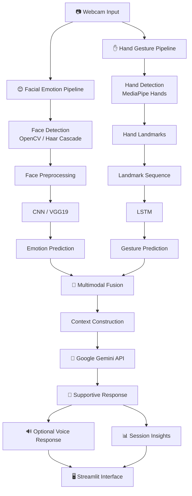

# 🧠EmotiVoice – AI-Assisted Emotional Support for Non-Verbal Individuals


---
### AI Therapist for Non-Verbal Communication

An AI-based multimodal communication system designed to support non-verbal users by combining **facial emotion recognition** and **hand gesture recognition** to understand non-verbal cues and generate supportive responses.

The system combines computer vision, deep learning, gesture recognition, and generative AI into an interactive real-time application.

---

## 🌟 Project Overview

Communication is not limited to spoken words. Facial expressions and hand gestures can communicate important emotional and conversational information, especially for people who have difficulty communicating verbally.

This project aims to provide a supportive AI interface that can:

- Detect emotions from facial expressions.
- Recognize predefined hand gestures/signs.
- Combine facial emotion and gesture information.
- Generate context-aware supportive responses.
- Provide optional voice feedback.
- Maintain a conversational session.
- Provide session insights and an exportable session summary.

The application is implemented as an interactive **Streamlit** application.

---

## 🎯 Objectives

The main objectives of this project are:

1. Develop a real-time facial emotion recognition system.
2. Recognize hand gestures using landmark-based sequence classification.
3. Combine multiple non-verbal communication signals.
4. Generate supportive responses based on the detected emotional state.
5. Provide voice feedback for generated responses.
6. Create an accessible interface for non-verbal communication support.
7. Maintain interaction history and provide session-level insights.

---

## ✨ Key Features

### 😊 Facial Emotion Recognition

The system analyzes facial expressions captured through the camera and predicts emotions such as:

- Happy
- Sad
- Angry
- Surprise
- Neutral

The facial emotion model is implemented using deep learning with TensorFlow/Keras.

---

### ✋ Hand Gesture Recognition

The application uses **MediaPipe Hands** to detect hand landmarks.

The extracted landmark sequences are passed to an LSTM-based gesture recognition model.

Supported gestures include examples such as:

- Yes
- No
- Help
- Happy
- Sad
- Angry
- Pain

---

## 🛠️ Tech Stack

| Category | Technologies | Purpose |
|---|---|---|
| **Programming Language** | Python | Core development |
| **Application Framework** | Streamlit | Interactive web application |
| **Computer Vision** | OpenCV | Webcam access and image processing |
| **Face Detection** | Haar Cascade | Face detection |
| **Facial Emotion Recognition** | CNN / VGG19 | Emotion classification |
| **Hand Detection** | MediaPipe Hands | Hand landmark extraction |
| **Gesture Recognition** | LSTM | Sequential gesture classification |
| **Deep Learning** | TensorFlow / Keras | Model development and inference |
| **Generative AI** | Google Gemini API | Supportive response generation |
| **Data Processing** | NumPy / Pandas | Data processing and analysis |
| **Voice Output** | Browser Speech Synthesis | Voice response |
| **Version Control** | Git / GitHub | Source code management |

---

## 🏗️ System Architecture

The system follows a multimodal AI pipeline that processes facial expressions and hand gestures independently and combines the results to generate a supportive response.



## 🧠 Algorithms & AI Models

The system combines multiple AI and machine learning techniques, with each model responsible for a specific part of the multimodal communication pipeline.

| Module | Algorithm / Model | Purpose |
|---|---|---|
| 😊 Facial Emotion Recognition | CNN / VGG19 | Extract facial features and classify emotions |
| ✋ Face Detection | Haar Cascade / OpenCV | Detect the face from webcam frames |
| 🤟 Hand Detection | MediaPipe Hands | Detect hands and extract landmark coordinates |
| ✋ Gesture Recognition | LSTM | Learn temporal patterns from hand landmark sequences |
| 🧠 Multimodal Processing | Emotion + Gesture Fusion | Combine multiple non-verbal signals |
| 🤖 Response Generation | Google Gemini API | Generate context-aware supportive responses |
| 🔊 Voice Response | Speech Synthesis | Convert generated responses into voice |

## 📊 Dataset

- **WLASL:** Used for hand gesture/sign recognition experimentation.
- **Facial Emotion Dataset:** Used for training and evaluating the facial emotion recognition model.
- Hand videos are processed using MediaPipe to extract landmark sequences for LSTM-based gesture recognition.
- Facial images are preprocessed before being passed to the emotion recognition model.

  ---

  ## 📂 Project Structure

```text
ai-emotion-recognition-support-system/
│
├── development_scripts/
│   └── Development and utility scripts
│
├── src/
│   └── Source and model-related components
│
├── training/
│   └── Model training and dataset-related files
│
├── app.py
│   └── Main Streamlit application
│
├── config.py
│   └── Application configuration
│
├── analyze_dataset.py
│   └── Dataset analysis utility
│
├── inspect_json.py
│   └── Dataset / JSON inspection utility
│
├── test_predictions.py
│   └── Model prediction testing
│
├── gesture_training_history.csv
│   └── Gesture model training history
│
├── WLASL_v0.3.json
│   └── WLASL dataset metadata
│
├── haarcascade_frontalface_default.xml
│   └── Face detection classifier
│
├── requirements.txt
│   └── Python dependencies
│
└── README.md
    └── Project documentation
```

## ⚙️ Installation & Setup

### 1. Clone the Repository

```bash
git clone https://github.com/Vaishnavi-tokale/ai-emotion-recognition-support-system.git
```

### 2. Navigate to the Project

```bash
cd ai-emotion-recognition-support-system
```

### 3. Create a Virtual Environment

```bash
python -m venv venv
```

### 4. Activate the Virtual Environment

#### Windows

```bash
venv\Scripts\activate
```

### 5. Install Dependencies

```bash
pip install -r requirements.txt
```

### 6. Run the Application

```bash
streamlit run app.py
```

The application will open at:

```text
http://localhost:8501
```

## 🔑 API Configuration

The application uses the **Google Gemini API** to generate AI-powered supportive responses.

### Configure Gemini API Key

Create an API key and configure it in your local environment.

```text
GEMINI_API_KEY=your_api_key_here
```

Make sure the API key is kept private and is **never uploaded to GitHub**.

> ⚠️ Do not hard-code your API key directly into the source code or commit it to the repository.

---
